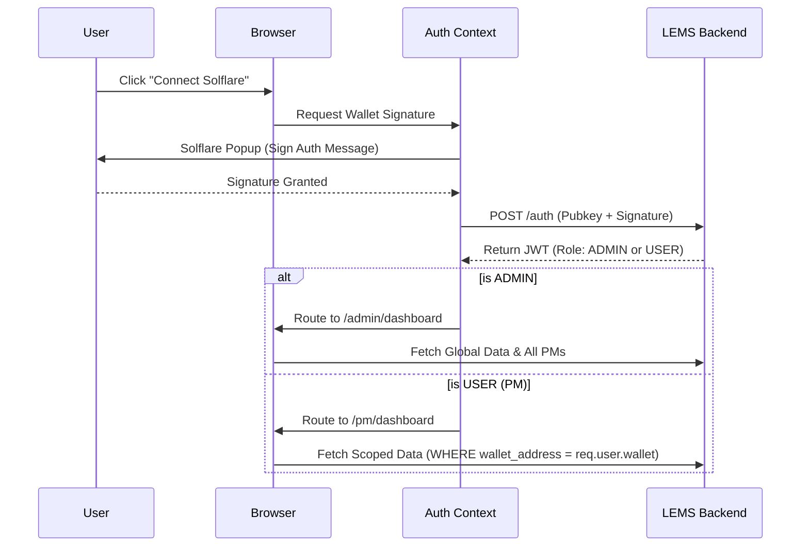

---

**Document Version:** 1.0

**Status:** Draft

**Scope:** Client-Side Architecture, Component Hierarchy, and Role-Based Routing

---

## **1. Introduction & Architecture Overview**

This document outlines the frontend implementation strategy for LEMS. The application will be built as a Single Page Application (SPA) using **React** and styled with **Tailwind CSS** to ensure rapid development and responsive design. The frontend will heavily rely on the Solana Wallet Adapter to handle user authentication via Solflare Crypto Cards.

### **1.1. Core Frontend Principles**

- **Wallet-First Authentication:** Users log in exclusively by connecting and signing a message with their Solflare wallet.
- **Strict RBAC Routing:** The UI will read the user's role upon wallet connection to determine routing and data visibility.
- **Real-Time Reactivity:** The UI will leverage WebSockets or polling to reflect on-chain reality within a 10-second threshold.

---

## **2. Authentication & Role-Based Logic**

The foundation of the frontend is the login flow, which branches the application state based on the authenticated user's role.

### **2.1. Login Window / Flow**

- **Component:** `<LoginView />`
- **Logic:**
  1. User clicks "Connect Wallet" using the `@solana/wallet-adapter-react` component.
  2. Once connected, the frontend prompts the user to sign a standard message to verify ownership.
  3. The signature and public key are sent to the backend.
  4. The backend returns a JWT/Session object containing the user's `role` (ADMIN or USER) and `pm_id`.
  5. The `<AuthContext />` stores this state and redirects the user.

### **2.2. Routing Protection**

- **If `role === 'ADMIN'`**: Route to `/admin/dashboard`. The UI renders the global treasury pulse, all PMs, and the full transaction feed.
- **If `role === 'USER'`**: Route to `/pm/dashboard`. The UI restricts views strictly to their own wallet, current balance, and personal transaction history.

---

## **3. Page & Window Implementations**

### **3.1. Admin Dashboard (`/admin/dashboard`)**

This is the command center for Treasurer Teodor. It is composed of multiple critical widgets.

- **`<TreasuryPulseHeader />`**:
  - **Description:** A high-level summary at the top of the dashboard assessing company liquidity.
  - **Implementation:** Displays the Master Treasury balance (USDC/SOL) and the Total Distributed Balance across all PMs. Updates automatically every 10 seconds.
- **`<PMRegistryPanel />`**:
  - **Description:** The interface to manage the PM registry (CRUD operations).
  - **Implementation:** A data table displaying PM Name, Project ID, Target Balance, and a visual `is_active` toggle switch. Includes a "Pause" button next to each PM to immediately exclude them from refills if a card is lost.
- **`<BatchRefillModule />`**:
  - **Description:** The interface for approving the 1st-of-the-month automated refills.
  - **Implementation:** Listens for backend notifications. When a batch is ready, it presents a "Pending Approvals" screen. Clicking "Approve" triggers a backend call to sign the transaction using the Master Treasury key.
- **`<GlobalTransactionFeed />`**:
  - **Description:** A scrollable, real-time feed of all company spending.
  - **Implementation:** Fetches data from `GET /api/v1/transactions`. Distinguishes internal "REFILL" transfers from external "SPEND" transactions using color coding. Displays Merchant Name, Amount, and resolving the Project ID.
- **`<ExportReportsModal />`**:
  - **Description:** A tool for month-end reconciliation.
  - **Implementation:** UI filters for Date Range, PM Name, and Project ID. Downloads filtered data in CSV or JSON formats.

### **3.2. User / PM Dashboard (`/pm/dashboard`)**

This is the restricted view for Cardholders like PM Petya.

- **`<PersonalBudgetCard />`**:
  - **Description:** Displays the PM's immediate purchasing power.
  - **Implementation:** Shows their specific current balance and their "Target Monthly Balance".
- **`<PersonalTransactionFeed />`**:
  - **Description:** A filtered view of their own activity.
  - **Implementation:** Reuses the transaction feed component but strictly passes their own `pm_id` to the backend to ensure they cannot see global spending. Includes links to the Solana Explorer for their specific transactions.

---

## **4. Custom Hooks & State Management**

To keep the components clean, we will implement several custom React hooks to handle backend communication and WebSocket subscriptions.

| **Hook Name**                 | **Purpose & Internal Logic**                                                                                                                                                                                                                                  |
| ----------------------------- | ------------------------------------------------------------------------------------------------------------------------------------------------------------------------------------------------------------------------------------------------------------- |
| `useAuth()`                   | Manages the wallet connection state, stores the JWT, and provides `isAdmin` and `isUser` boolean flags to the router.                                                                                                                                         |
| `useLiveTransactions(pm_id?)` | Fetches the initial transaction list and opens a WebSocket listener to the backend. If an Admin is logged in, `pm_id` is null (fetches all). If a User is logged in, it enforces the filter. Pushes new events to the top of the UI feed in under 10 seconds. |
| `useRegistryManager()`        | **Admin Only.** Exposes functions to `addPM()`, `editTargetBalance()`, and `toggleEmergencyPause()`. Optimistically updates the UI registry table before the database confirms.                                                                               |
| `useRefillEngine()`           | **Admin Only.** Polls for the calculated refill batch. Exposes an `approveBatch()` function that calls the `/api/v1/refill/propose` endpoint with the required authentication headers.                                                                        |

---

## **5. User Flow Diagram: View Initialization**



# 6. API endpoints

## 1. Authentication Contract

Before any data is fetched, the frontend must establish the user's identity and role.

**`POST /api/v1/auth/verify`**

- **Purpose:** Verifies the cryptographic signature from the Solflare wallet and returns a session token with the user's role.
- **Request Payload (from Frontend):**

```json
{
  "wallet_address": "8x...SolanaPubKey...9Y",
  "message": "Sign this message to authenticate with LEMS. Nonce: 123456",
  "signature": "5z...cryptographic_signature...ab"
}
```

- **Response Payload (to Frontend):**

```json
{
  "status": "success",
  "token": "jwt_header.jwt_payload.jwt_signature",
  "user": {
    "id": "uuid-1234-5678",
    "role": "ADMIN",
    "wallet_address": "8x...SolanaPubKey...9Y",
    "name": "Teodor",
    "project_id": null
  }
}
```

_(Note: If the role was `USER`, the `project_id` would be populated, and `name` would reflect the PM, e.g., "Petya".)_

---

## **2. Registry & PM Management Contracts (Admin Only)**

These contracts power the `<PMRegistryPanel />`.

**`GET /api/v1/registry`**

- **Purpose:** Retrieves the list of all registered Project Managers, their current on-chain balances, and their status.
- **Request Headers:** `Authorization: Bearer <token>`
- **Response Payload:**

```json
{
  "pm_list": [
    {
      "id": "uuid-abcd-efgh",
      "name": "Petya",
      "project_id": "Project-A",
      "wallet_address": "7a...SolanaPubKey...2b",
      "target_balance": 500.0,
      "current_balance": 45.5,
      "is_active": true
    },
    {
      "id": "uuid-ijkl-mnop",
      "name": "Ivan",
      "project_id": "Project-B",
      "wallet_address": "3c...SolanaPubKey...4d",
      "target_balance": 300.0,
      "current_balance": 300.0,
      "is_active": false
    }
  ]
}
```

**`POST /api/v1/registry`**

- **Purpose:** Creates a new PM entry in the database.
- **Request Payload:**

```json
{
  "name": "Georgi",
  "project_id": "Project-C",
  "wallet_address": "9e...SolanaPubKey...5f",
  "target_balance": 400.0,
  "currency_id": "uuid-currency-usdc"
}
```

- **Response Payload:**JSON

```json
{
  "status": "success",
  "message": "PM successfully registered.",
  "data": {
    "id": "uuid-qrst-uvwx",
    "is_active": true
  }
}
```

---

### **3. Transaction Feed Contracts**

This endpoint powers both the Admin's `<GlobalTransactionFeed />` and the PM's `<PersonalTransactionFeed />`.

**`GET /api/v1/transactions`**

- **Purpose:** Fetches the unified transaction feed (Refills + Merchant Spend).
- **Query Parameters:** `?limit=20&type=SPEND&pm_id=uuid-abcd-efgh`_(Crucial Note: As discussed, if a `USER` calls this, the backend middleware will ignore the `pm_id` query param and forcibly override it with `req.user.id` to prevent unauthorized data access.)_
- **Response Payload:**JSON

```json
{
  "transactions": [
    {
      "id": "uuid-tx-101",
      "signature": "4v...SolanaTxHash...8w",
      "type": "SPEND",
      "merchant_name": "Burger House",
      "pm_id": "uuid-abcd-efgh",
      "pm_name": "Petya",
      "project_id": "Project-A",
      "amount": 120.5,
      "currency": "USDC",
      "status": "COMPLETED",
      "block_time": "2026-02-15T19:30:00Z"
    },
    {
      "id": "uuid-tx-102",
      "signature": "6x...SolanaTxHash...9y",
      "type": "REFILL",
      "merchant_name": "Master Treasury Refill",
      "pm_id": "uuid-abcd-efgh",
      "pm_name": "Petya",
      "project_id": "Project-A",
      "amount": 454.5,
      "currency": "USDC",
      "status": "COMPLETED",
      "block_time": "2026-02-01T00:01:15Z"
    }
  ],
  "pagination": {
    "has_more": true,
    "next_cursor": "2026-02-01T00:01:15Z"
  }
}
```

---

### **4. Execution & Refill Contracts (Admin Only)**

This is the payload triggered when the Admin clicks "Approve" on the 1st of the month.

**`POST /api/v1/refill/propose`**

- **Purpose:** Allows an authenticated Admin to explicitly approve and execute the calculated batch refill directly to the blockchain.
- **Request Payload:**

```json
{
  "reason": "Monthly automated refill batch for March 2026"
}
```

- **Response Payload:**

```json
{
  "status": "success",
  "message": "Batch transfer executed successfully.",
  "data": {
    "batch_signature": "2z...SolanaTxHash...7a",
    "total_distributed": 1250.0,
    "wallets_funded": 3
  }
}
```

## **7. WebSocket Event Contracts (Real-Time Feed)**

To fulfill the requirement of updating the dashboard within 10 seconds of block finality, the backend will push events to the frontend via WebSockets. The `useLiveTransactions` hook will listen for these specific event types.

### **7.1. Event: `NEW_TRANSACTION`**

Pushed when the backend monitor detects and successfully parses a new on-chain event (either a card spend or a refill).

- **Routing Logic:** If the user is an `ADMIN`, they receive all `NEW_TRANSACTION` events. If the user is a `USER` (PM), the backend only pushes the event down their specific socket connection if `payload.pm_id` matches their session.

**Payload:**

- **Frontend Action:** The `useLiveTransactions` hook catches this, plays a subtle UI animation, and unshifts the new transaction to the top of the `<GlobalTransactionFeed />` or `<PersonalTransactionFeed />`.

### **7.2. Event: `PM_STATUS_CHANGED`**

Pushed when an Admin makes a critical change to a PM's status (e.g., triggering the Emergency Pause).

**Payload:**

- **Frontend Action:** If the Admin has the `<PMRegistryPanel />` open, the toggle switch for that PM instantly flips to inactive, and a warning badge appears, ensuring multiple admins viewing the dashboard stay perfectly in sync.

---

## **8. Error Handling & Validation States**

Because this system manages corporate funds, the frontend must strictly validate inputs before sending them to the backend, and gracefully handle network or authorization errors.

### **8.1. `<PMRegistryPanel />` Form Validation**

When the Treasurer adds or edits a Project Manager, the frontend form must enforce the following rules before allowing submission:

- **Wallet Address Validation:** \* **Rule:** Must be exactly 44 characters long and constitute a valid Base58 encoded Solana Public Key.
  - **Error State:** If invalid, disable the "Save" button and display inline red text: _"Invalid Solana address format. Must be a 44-character public key."_
- **Target Balance Validation:**
  - **Rule:** Must be a positive numeric value greater than 0.
  - **Error State:** _"Target balance cannot be negative or zero."_
- **Project ID Validation:**
  - **Rule:** Must be a non-empty string.
  - **Error State:** _"A Project ID must be assigned to this wallet."_

### **8.2. API Response Error Handling**

The frontend API service wrapper will catch specific HTTP status codes and trigger global UI toast notifications.

### **8.3. RPC & Network Degradation**

Given that Solana RPC nodes can experience intermittent latency, the frontend must account for network degradation.

- **WebSocket Disconnect:** If the WebSocket connection drops, the frontend will display a persistent yellow banner: _"Live Feed Disconnected. Attempting to reconnect..."_ and will automatically fallback to polling `GET /api/v1/transactions` every 30 seconds until the socket is restored.
- **Transaction Pending State:** When the Admin clicks "Approve" for the monthly refill, the UI must enter a locked "Processing" state. It will not unlock until the backend returns the success payload confirming the batch has finalized on-chain.

## **9. Non-Functional Requirements (NFRs) & Tech Stack Standards**

To ensure a high-quality user experience and maintainable codebase, the frontend architecture must adhere to the following performance, accessibility, and ecosystem standards.

### **9.1. Recommended UI & Ecosystem Libraries**

Given the requirement for a React Single Page Application (SPA) styled with Tailwind CSS, we standardizing the following libraries to handle complex UI states:

- **Data Tables (Registry & Feeds):** `@tanstack/react-table`
  - _Rationale:_ A headless utility for building fast and highly customizable data tables. It will easily handle the `<PMRegistryPanel />` and the potentially massive `<GlobalTransactionFeed />` without bloat.
- **Charts & Analytics:** `recharts`
  - _Rationale:_ Required for the "Project-Based Spending Analytics". It is highly composable, React-native, and plays exceptionally well with Tailwind CSS for consistent theming.
- **Component Primitives:** `Radix UI` or `Headless UI`
  - _Rationale:_ Provides unstyled, fully accessible interactive components (like the `<ExportReportsModal />` and Dropdowns) that we can style completely with our Tailwind utility classes.
- **State & Data Fetching:** `TanStack Query` (React Query)
  - _Rationale:_ Ideal for caching, synchronizing, and updating the REST API data alongside our WebSocket feeds. It will handle the loading and error states automatically.

### **9.2. Performance & Load Times**

Because the system is used for real-time financial monitoring, the UI must feel instantaneous.

- **Time to Interactive (TTI):** The dashboard must become fully interactive within **1.5 seconds** on a standard broadband connection.
- **Code Splitting:** The application must utilize `React.lazy()` and Suspense to split the Admin Dashboard and the User (PM) Dashboard into separate bundles. A PM logging in should never download the Admin-heavy reporting or execution modules.
- **Feed Virtualization:** If a PM or Admin scrolls through the `<GlobalTransactionFeed />`, the list must be "virtualized" (e.g., using `@tanstack/react-virtual`). This ensures that even if there are 10,000 transactions in the DOM, only the visible items are rendered, keeping memory usage low and scrolling perfectly smooth at 60fps.

### **9.3. Accessibility (a11y)**

The internal tool must be usable by all LimeChain personnel.

- **WCAG 2.1 AA Compliance:** All text contrast ratios must meet standard requirements (especially for the red/green color coding distinguishing "SPEND" vs. "REFILL" transactions).
- **Keyboard Navigation:** The Treasurer must be able to navigate the `<PMRegistryPanel />`, trigger the "Emergency Pause", and execute the batch refills entirely via keyboard `Tab` and `Enter` keys.
- **Screen Reader Context:** Dynamic updates from the WebSocket (e.g., a new transaction appearing on the feed) should utilize `aria-live="polite"` regions so screen readers can announce new spending events without interrupting the user.

### **9.4. Frontend Security Practices**

While the backend enforces the strict Role-Based Access Control (RBAC), the frontend must adopt defensive programming techniques.

- **Token Storage:** The JWT retrieved during the `<LoginView />` flow must be stored securely. If a Backend-For-Frontend (BFF) is not used, the token should ideally be kept in application memory (`Context`) or `sessionStorage` rather than `localStorage` to mitigate Cross-Site Scripting (XSS) payload persistence.
- **Data Sanitization:** Merchant names extracted directly from the Solana blockchain must be treated as untrusted user input. React automatically escapes strings rendered in the DOM, but developers must ensure no raw HTML parsing (like `dangerouslySetInnerHTML`) is ever used when rendering the `<GlobalTransactionFeed />`.
