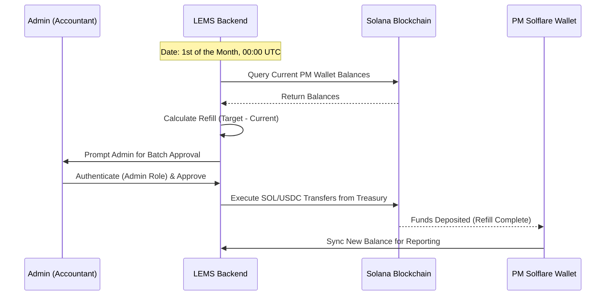
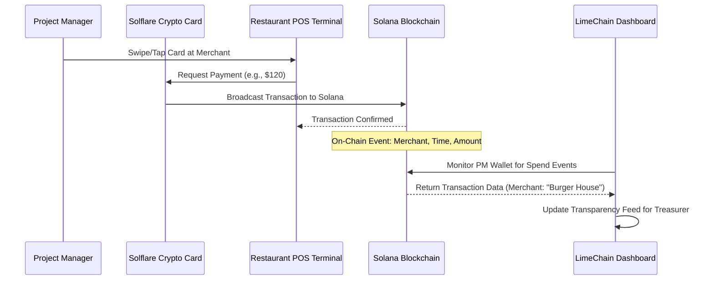

# **LimeChain Expense Management System**

---

**Document Version:** 1.0

**Date:** February 9, 2026

**Author:** Galin Petrov

**Status:** Draft

---

## **1. Introduction & Executive Summary**

**LimeChain Expense Management System** is a foundational internal infrastructure project designed to streamline and automate spending through the Solana blockchain and **Solflare Crypto Cards**.

- **Problem Statement:** Current expense management at LimeChain relies on manual reimbursements or centralized corporate cards that lack real-time visibility. This results in significant **accounting overhead**, delays in fund availability for team morale events, and a lack of granular transparency into where budgets are spent on-chain.
- **Proposed Solution:** We will build a secure budget distribution platform that integrates directly with **Solflare’s** infrastructure. A central "Company Treasurer" will manage a master treasury to automatically "refill" the wallets of **Project Managers (PMs)** on a recurring monthly basis. PMs will use physical/virtual Solflare Cards for real-world spending, with all transactions instantly recorded and displayed for accounting transparency.
- **Key Goals & Business Value:**
  1. **Reduce Accounting Overhead:** Minimize manual reconciliation of small-claim receipts by moving to a pre-funded, on-chain budget model.
  2. **Radical Transparency:** Provide a live feed of all team-related spending (lunches, bars, activities) directly from the Solana explorer.
  3. **PM Visibility:** Empower PMs with real-time tracking of their own project budgets.

---

## **2. Business Case & Goals**

- **Business Opportunity:** Transitioning from traditional banking to a Solana-based expense system allows for instant, low-fee distributions and automated reporting.
- **Project Goals (SMART):**
  - **Objective 1 (Automation):** Implement a fully automated "Refill" mechanism that executes on the 1st of every month.
  - **Objective 2 (Transparency):** Ensure 100% of PM card transactions are visible in the internal dashboard within 10 seconds of block finality.
  - **Objective 3 (Overhead Reduction):** Reduce the time accounting spends on "Social/Team Expense" processing by **50%** within the first 90 days.
- **Success Metrics (KPIs):**
  - **Monthly Budget Velocity:** Total value of USDC/SOL distributed and spent.
  - **System Reliability:** Success rate of automated monthly transfers (Target: 99.9%).
  - **Reporting Accuracy:** Number of manual adjustments required by accounting per month (Target: <5%).

---

## **3. Target Audience & User Personas**

### **Persona 1: Treasurer Teodor**

- **Archetype:** The Financial Controller.
- **Bio:** Teodor manages the company’s treasury, user roles, and budget integrity.
- **Goals:** To distribute funds in a single batch, manage PM access, and monitor global real-time spending.
- **Pain Points:** _"I hate manual reconciliations and chasing people for paper receipts."_

### **Cardholder : PM Petya**

- **Archetype:** Project Manager.
- **Bio:** Petya manages a development team and organizes weekly team-building events.
- **Goals:** To have a funded card at the start of the month and a personal dashboard to see her remaining budget and transaction history.
- **Pain Points:** _"I don't want to use my personal money, and I need to know exactly how much budget my project has left."_
- **Access:** She has "User" access to the LEMS Dashboard, restricted strictly to her own wallet and project data.

---

## **4. Scope**

### **In-Scope:**

- **Role-Based LEMS Dashboard:** Distinct views for Admins (global view/control) and Users (personal view).
- **Automated Budget Distribution:** Logic to "Refill" PM wallets to a target balance for a specific currency (USDC/SOL) on the 1st of every month.
- **Solflare Integration:** Connectivity with Solflare Crypto Cards and Solana-compatible wallets.
- **Reporting:** A real-time transaction feed pulling merchant data, amounts, and timestamps from the blockchain.

### **Out-of-Scope:**

- **Multi-Chain Support:** Support is limited exclusively to the Solana network.
- **Multi-Sig Treasury:** The Master Treasury will be managed via a secure single-sig environment controlled by the Admin backend.

---

## **5. Functional Requirements**

### **Wallet & Registry Management**

- **FR-1:** The system **shall** allow the Admin to securely connect and fund a Master Treasury wallet.
- **FR-2:** The system **shall** allow the Admin to register PMs, assigning them a unique wallet address, Project ID, and "User" login access.
- **FR-3:** The system **shall** provide PMs (Users) a dashboard view restricted to their own current balances and transaction history.

### **Budget Distribution Logic**

- **FR-4:** The system **shall** allow the Treasurer to set a "Target Monthly Balance" for each PM.
- **FR-5:** The system **shall** initiate a batch transfer to "Refill" all PM wallets to their target amounts.

### **Transparency & Monitoring**

- **FR-7:** The system **shall** pull and display "Spend" events from the blockchain, including Merchant Name and Amount.
- **FR-8:** The system **shall** allow the Treasurer to export transaction logs into CSV/JSON formats for accounting.
- **FR-9 (Cryptographic Authentication):** The system shall authenticate users by verifying an `ed25519` cryptographic signature generated by their Solflare wallet against a plaintext message. Upon successful verification, the system shall issue a stateless JWT containing the user's role and UUID.
- **FR-10 (Emergency Circuit Breaker):** The system shall provide Admins with a "Pause" toggle for each PM to immediately set their `is_active` status to false. This action must exclude the PM from the next automated refill cycle and broadcast a real-time WebSocket event to sync the UI for all connected Admins.
- **FR-11 (Administrative Audit Logging):** The system shall record an immutable audit log for all successful Admin actions, including registry modifications and batch refill executions. The log must capture the Admin's wallet address, the timestamp, and a description of the target action.
- **FR-12 (Transaction Back-filling):** The system shall run a back-filler service on startup and periodically to query historical signatures, ensuring no transactions are missed during WebSocket disconnects or RPC outages.
- **FR-13 (Dynamic Network Fees):** The system shall query recent prioritization fees before executing a batch refill. It must append a dynamic compute unit price instruction to the transaction to guarantee inclusion in the next block during high network congestion.
- **FR-14 (Advanced Reporting Filters):** The system shall allow Admins to generate exportable financial reports (CSV/JSON) filtered by Date Range, PM Name, and Project ID, alongside a summary section.
- **FR-15 (Cryptographic Address Validation):** Both the frontend client and backend API must strictly enforce that any submitted `wallet_address` is exactly 44 characters in length and constitutes a valid Base58 encoded Solana Public Key.
  - **Frontend handling:** The UI must disable the form submission and display an inline error state if this format is violated.
  - **Backend handling:** The API must catch invalid formats via DTO validation and return a `400 Bad Request`.
- **FR-16 (Target Balance Constraints):** The system must validate that the "Target Monthly Balance" is a positive numeric value strictly greater than zero. Negative or zero values must be rejected by both the UI and the API.
- **FR-17 (Project ID Integrity):** The frontend form must enforce that the Project ID field is a non-empty string before allowing the creation of a new PM registry entry.
- **FR-18 (Pre-Flight Transaction Simulation):** Before the backend signs and broadcasts the monthly batch refill, the Execution Service must simulate the transaction via the Solana RPC. If the simulation fails (e.g., due to insufficient Master Treasury funds), the system must abort the signature and return a `422 Unprocessable Entity` to prevent failed on-chain fee penalties.
- **FR-19 (CORS & Domain Restriction):** As a backend security constraint, Cross-Origin Resource Sharing (CORS) must be strictly limited to the specific domains hosting the frontend application to prevent cross-origin attacks.
- **FR-20 (Frontend Data Sanitization):** The frontend must treat merchant names extracted from the blockchain as untrusted user input and ensure no raw HTML parsing is used when rendering the Global Transaction Feed to mitigate Cross-Site Scripting (XSS) risks.

---

## **6. Non-Functional Requirements**

### **Performance & Security**

- **NFR-1 (Access Control):** The system must implement strict Role-Based Access Control (RBAC). Admins have global read/write access; Users have scoped read-only access.
- **NFR-2 (Synchronization):** Dashboard data must sync with on-chain events in under 10 seconds.
- **NFR-3 (Reliability):** Automated scripts must include retry logic to handle network congestion.

### **Usability**

- **NFR-4 (UI Feedback):** The system must clearly distinguish between internal "Refill" transfers and external "Merchant" spending.
- **NFR-5 (Frontend Performance & Virtualization):** The frontend application must achieve a Time to Interactive (TTI) of under 1.5 seconds on a standard broadband connection. Long lists, such as the Global Transaction Feed, must utilize UI virtualization to maintain smooth 60fps scrolling performance while keeping memory usage low.
- **NFR-6 (Master Key Security):** The Master Treasury private key must never be stored in the database or exposed to the frontend. It must be loaded into memory exclusively during transaction signing and immediately cleared via garbage collection.
- **NFR-7 (Idempotency & Data Integrity):** The database schema must enforce a unique constraint on the Solana transaction `signature` column to guarantee that no spend or refill event is processed or displayed twice.
- **NFR-8 (RPC Resiliency & Fallback):** The backend must implement a round-robin or fallback array of RPC endpoints to maintain connection stability if rate limits (HTTP 429) or WebSocket drops occur. Furthermore, the frontend must gracefully degrade to polling every 30 seconds if its WebSocket connection drops.
- **NFR-9 (Accessibility - a11y):** The user interface must comply with WCAG 2.1 AA standards, ensuring proper text contrast for transaction color-coding. Dynamic dashboard updates pushed via WebSockets must utilize `aria-live` regions to support screen readers without interrupting the user.
- **NFR-10 (Query Latency):** Database indexing on `pm_id` and `block_time` must ensure that the transaction feed API endpoint responds in under 50ms, even with large historical datasets.

---

## **7. Risks & Mitigation**

| **Risk ID** | **Description**                                              | **Impact** | **Mitigation Plan**                                                                                                                      |
| ----------- | ------------------------------------------------------------ | ---------- | ---------------------------------------------------------------------------------------------------------------------------------------- |
| RISK-01     | **Master Wallet Leak:** Unauthorized distribution of funds.  | High       | Treasury private key is isolated in secure backend environment variables; UI requires Admin wallet signature to trigger batch execution. |
| RISK-02     | **Network Failure:** Congestion prevents refills on the 1st. | Medium     | Implement automated **Retry Logic** and manual Admin override buttons.                                                                   |
| RISK-03     | **Card Security:** PM loses their physical Solflare card.    | Medium     | Admin dashboard feature to instantly "Pause" distributions to that specific wallet.                                                      |

## 8. User Flows & Diagrams

### The 'Monthly Refill' Process

1. **Step 1: System Audit**
   On the 1st of each month, the LimeChain Dashboard automatically queries the Solana blockchain to check the current balances of all registered PM wallets.
2. **Step 2: Refill Calculation**
   The system calculates the difference between the PM's current balance and their "Target Monthly Balance" set by the Treasurer.
3. **Step 3: Approval & Execution**
   The Admin receives a notification in their dashboard to review the calculated batch transfer. Once the Admin authenticates and clicks approve, the backend securely signs the transaction using the Master Treasury key and executes the batch transfer directly to the individual PM wallets.

### The 'Real-World Spend' Transparency

1. **Step 1: Merchant Transaction**
   The PM taps their Solflare Card at a restaurant. The transaction is immediately broadcast and confirmed on the Solana network.
2. **Step 2: Real-time Monitoring**
   The LimeChain Dashboard, monitoring the PM's wallet address, identifies the new transaction event and pulls the metadata (Merchant name, time, and amount).
3. **Step 3: Automated Transparency**
   The dashboard updates the "Live Feed" for the Treasurer, providing instant proof of spending without the need for a physical receipt.

