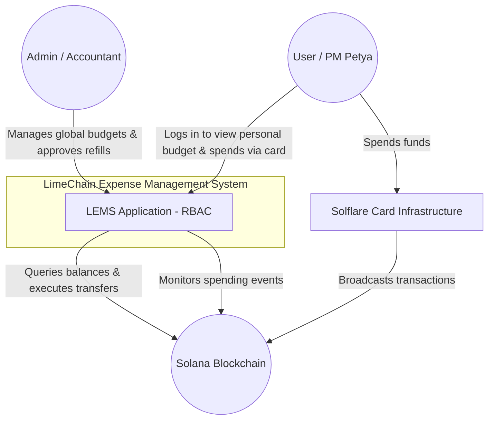
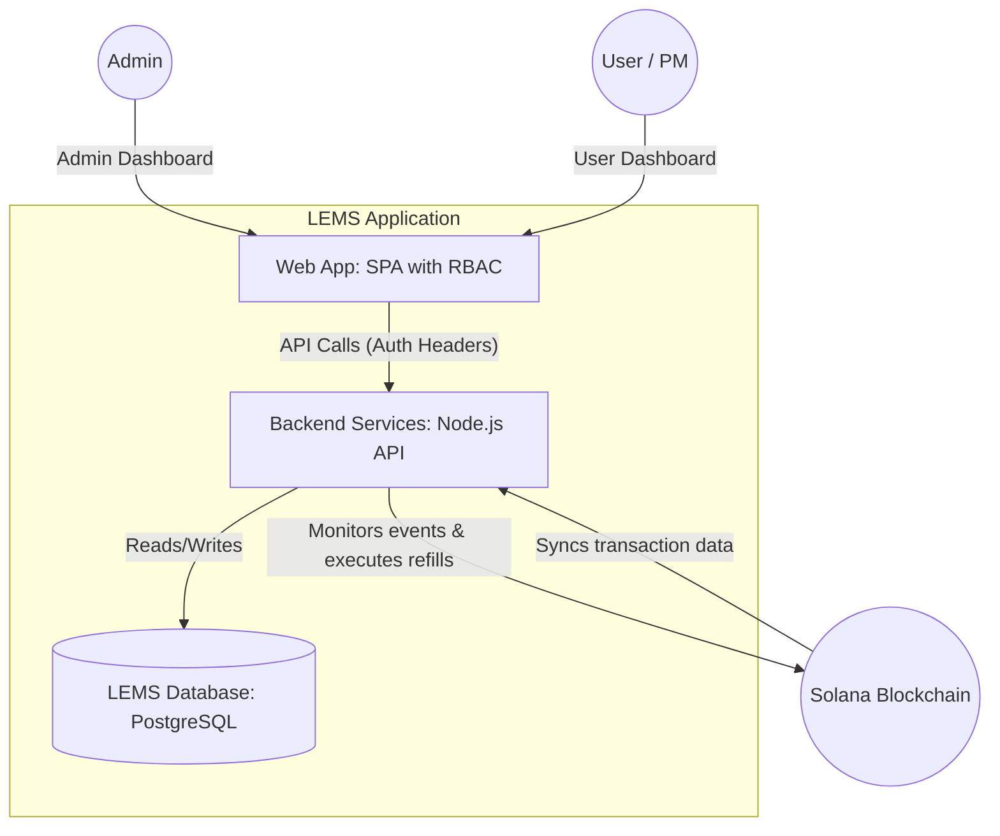
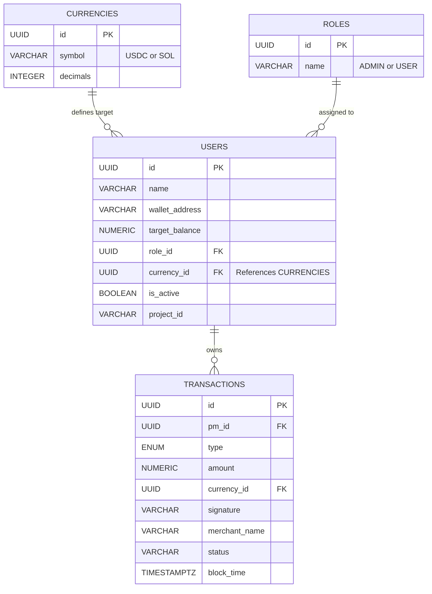
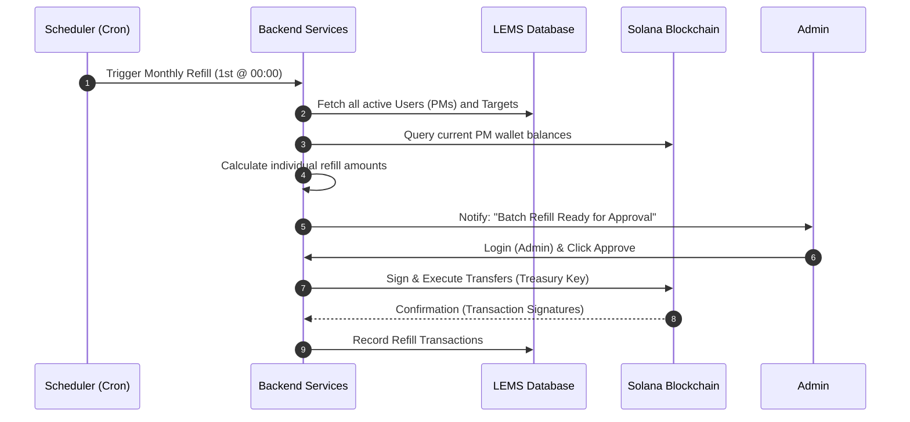
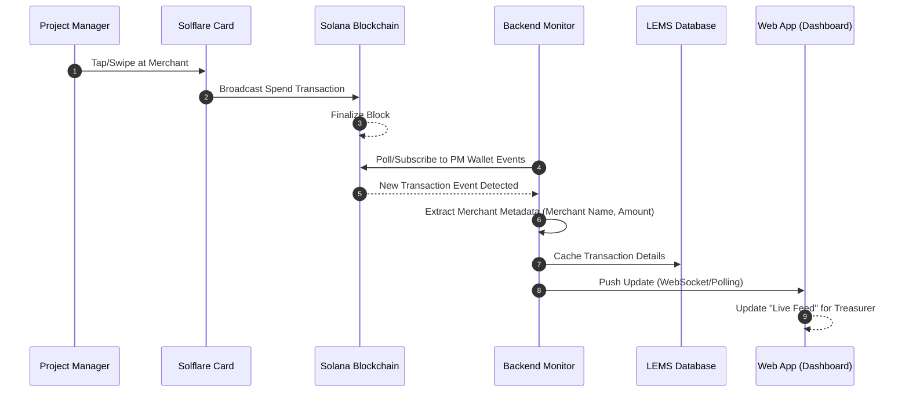
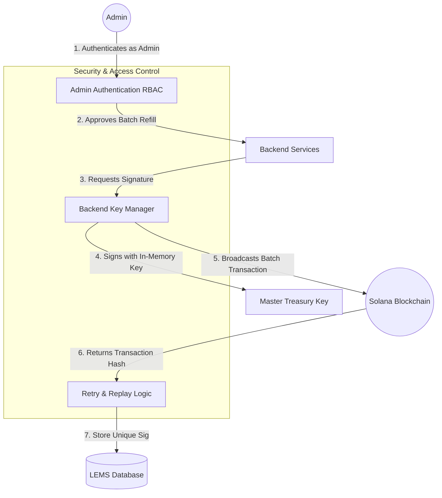
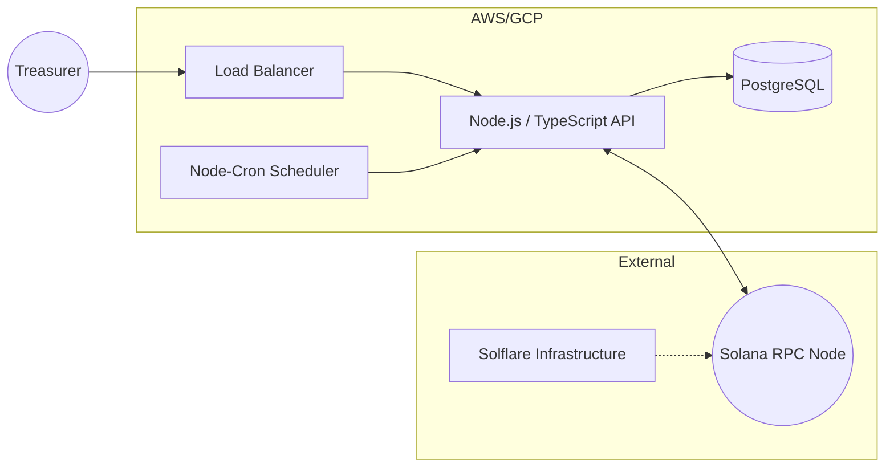

# **1. Introduction**

## **1.1. Purpose and Scope**

This document provides the technical design for the **LimeChain Expense Management System (LEMS)**. Its purpose is to define the architecture for an automated, blockchain-based budget distribution and tracking system utilizing the Solana network and Solflare Crypto Cards.

The scope includes:

- **On-Chain Interactions:** Managing distributions from a Master Treasury and monitoring spending events.
- **Backend Services:** Logic for calculating monthly refills and syncing on-chain data.
- **Treasurer Dashboard:** The primary interface for budget management and transparency.

## 1.2 Definitions

| **Term** | **Definition**                                                                                |
| -------- | --------------------------------------------------------------------------------------------- |
| Refill   | The automated process of topping up a PM's wallet to a predefined "Target Monthly Balance".   |
| Admin    | Accountant role with global read/write access and approval rights for treasury distributions. |
| User     | Project Manager (PM) role with scoped read-only access to their own budget and transactions.  |

---

# **2. Architectural Goals and Constraints**

## **2.1. Key Goals**

- **Automation:** Achieving a recurring "Refill" mechanism that executes on the 1st of every month.
- **Transparency:** Providing 100% visibility into card transactions within 10 seconds of block finality.
- **Efficiency:** Reducing accounting overhead for manual receipt reconciliation by 50%.

## **2.2. Constraints**

- **Network:** Exclusively limited to the **Solana** blockchain.
- **Asset Support:** Initial support is restricted to **USDC and SOL**.
- **Integration:** Dependency on **Solflare's** card infrastructure for real-world spending.

---

# **3. System Overview (C4 Level 1: System Context)**

This view shows how LEMS fits into the LimeChain ecosystem and interacts with external actors and the blockchain.

### **3.1. Diagram Summary**

- **The Treasurer** uses the system to set targets and approve the monthly batch refills
- **Project Managers** interact primarily with their physical/virtual **Solflare Cards**, while the LEMS monitors the results.
- **The Solana Blockchain** acts as the immutable source of truth for all balances and transaction history.

# **4. High-Level Design (C4 Level 2: Container View)**

### **4.2. Container Descriptions**

- **Web App**: A client-side application (React) providing the interface for the Treasurer to manage the PM registry and view the live spending feed.
- **Backend Services**: The central logic engine. It calculates the "Refill" amounts on the 1st of each month and pulls merchant metadata from the Solana blockchain.
- **LEMS Database**: A relational database (PostgreSQL) that stores PM data, target balances, and cached transaction history for fast dashboard loading.
- **Solana Blockchain**: The external source of truth for all wallet balances and card spending events.

# 5. Data Design

This section details the storage strategy for LEMS. To ensure radical transparency and fast dashboard performance, we will cache relevant on-chain data in a relational database.

## **5.1. Data Model Analysis**

For LEMS, we will use a **relational schema** in PostgreSQL.

- **Rationale:** Since we need to manage a registry of PMs and link them to specific project IDs and a history of transactions, a relational model ensures data integrity. It allows the Treasurer to quickly query spending by project or by PM.

## **5.2. Entity-Relationship Diagram (ERD)**

Code snippet

---

## **5.3. Database Schema Definitions**

### **5.3.1. `currencies` Table**

| Column     | Type      | Description                             |
| ---------- | --------- | --------------------------------------- |
| `id`       | `UUID`    | Unique identifier.                      |
| `symbol`   | `VARCHAR` | The asset symbol (e.g., "USDC", "SOL"). |
| `decimals` | `INTEGER` | Asset symbol decimals                   |

### **5.3.1. `roles` Table**

| Column | Type      | Description        |
| ------ | --------- | ------------------ |
| `id`   | `UUID`    | Unique identifier. |
| `name` | `VARCHAR` |                    |

### **5.3.2. `users` Table**

This table acts as the source of truth for the Treasurer’s registry.

| **Column**       | **Type**      | **Description**                                                |
| ---------------- | ------------- | -------------------------------------------------------------- |
| `id`             | `UUID`        | Unique internal identifier.                                    |
| `wallet_address` | `VARCHAR(44)` | The PM's Solana address used for the Solflare Card.            |
| `target_balance` | `NUMERIC`     | The amount the wallet should be "topped up" to every month.    |
| `name`           | `VARCHAR`     | Full Name of PM                                                |
| `is_active`      | `BOOLEAN`     | Status of the PM Card                                          |
| `created_at`     | `TIMESTAMPTZ` | Date of creation                                               |
| `project_id`     | `VARCHAR`     | Project ID associated with this manager                        |
| `currency_id`    | `UUID`        | **FK.** Links to the specific currency for the target balance. |
| `role_id`        | `UUID`        | FK. Links user to specific role                                |

### **5.3.3. `transactions` Table**

Used to populate the "Live Feed" and for accounting exports.

| **Column**      | **Type**      | **Description**                                                                   |
| --------------- | ------------- | --------------------------------------------------------------------------------- |
| `signature`     | `VARCHAR(88)` | **Unique Index.** The Solana transaction hash to prevent duplicates.              |
| `type`          | `ENUM`        | Identifies if the record is a `REFILL` (internal) or `SPEND` (external merchant). |
| `merchant_name` | `TEXT`        | Extracted metadata for merchant transactions (e.g., "Burger House").              |
| `pm_id`         | `UUID`        | **FK.** Links the transaction to a Project Manager.                               |
| `amount`        | `NUMERIC`     | The numeric value of the transaction.                                             |
| `status`        | `VARCHAR`     | `PENDING`, `COMPLETED`, or `FAILED`.                                              |
| `block_time`    | `TIMESTAMPTZ` | Timestamp from the blockchain.                                                    |

---

## **5.4. Notes on Indexing**

- **Replay Protection:** A unique index on `signature` is mandatory to ensure the dashboard doesn't count the same transaction twice.
- **Performance:** An index on `(pm_id, block_time DESC)` will be created to ensure the "Live Feed" for specific managers loads instantly even as the transaction history grows.

# 6. Key Architectural Workflows

This section outlines the dynamic behavior of the LEMS, illustrating the sequence of interactions for the two most critical business processes.

## **6.1. The Monthly "Refill" Workflow**

This workflow describes the automated process that occurs on the 1st of every month to ensure all PM wallets are topped up to their target balances.

Code snippet

### **Workflow Rationale**

- **Efficiency:** The system automates the tedious calculation of "Current vs. Target" balances, reducing the Treasurer's work to a single approval click.

---

## **6.2. "Real-World Spend" Transparency Workflow**

This workflow illustrates how a PM’s real-world card usage is captured and displayed in the LEMS Dashboard in near real-time.

Code snippet

### **Workflow Rationale**

- **Real-Time Visibility:** The use of event monitoring ensures that the dashboard reflects on-chain reality within the required **10-second threshold** (NFR-2).
- **Accounting Accuracy:** By pulling metadata directly from the blockchain, the system provides a source of truth that eliminates the need for manual receipt submission.

# **7. Key Security Mechanisms**

This section outlines the essential security strategies to protect the Master Treasury and maintain system integrity, addressing the high-impact risks identified in the PRD.

---

## **7.1. Role-Based Access Control (RBAC)**

Access to the backend API and frontend views is strictly governed by wallet authentication.

- **Admins** can trigger the `/api/v1/refill/purpose` endpoint and view all data.
- **Users** calling data endpoints will have their queries automatically filtered `WHERE wallet_address = req.user.wallet`.

## **7.2. Replay & Duplicate Prevention**

To ensure financial accuracy and prevent accidental double-refills or double-counting of merchant spend, LEMS employs a two-layer check:

- **Database Level:** The `transactions` table enforces a **Unique Constraint** on the `signature` column (the Solana transaction hash).
- **Logic Level:** The Backend Monitor queries the database for an existing signature before attempting to record a new event, ensuring "idempotency"—where processing the same event multiple times has no additional effect.

## **7.3. "Pause" & Circuit Breaker Capability**

In the event of a lost or stolen PM card (**RISK-03**), the Treasurer must be able to act immediately.

- **Emergency Pause:** The Dashboard provides a "Pause" button for each PM registry entry. When toggled, the system will:
  1. Immediately exclude the wallet from the next automated **Monthly Refill** cycle.
  2. Set the `is_active` flag to `false` in the database, halting any automated monitoring for that address.

---

## **7.4. Security Architecture Diagram**

### **Section Summary**

- **Unique Signatures** prevent duplicate accounting.
- **Dashboard Controls** allow for manual overrides in case of physical card loss.

## **8. Backend API Endpoint Definitions**

This section defines the interface between the **Web App** and the **Backend Services**, enabling the Treasurer to manage the system.

### **8.1. GET** `/api/v1/registry`

- **Purpose**: Retrieves the list of all registered Project Managers, their current on-chain balances (queried via Backend), and their status.
- **Response**:JSON
  `{
    "pm_list": [
      { "id": "uuid", "name": "Petya", "wallet": "0x...", "target": 500.00, "current_balance": 45.50, "is_active": true }
    ]
  }s`

### **8.2. POST** `/api/v1/refill/purpose`

- **Purpose**: Allows an authenticated Admin to explicitly approve and execute the calculated batch refill directly to the blockchain.
- **Payload**: `{ "reason": "Monthly automated refill batch" }`
- **Effect**: Backend uses the secure Master Treasury key to sign the transaction, broadcasts it, and returns the transaction signature.

### **8.3. GET** `/api/v1/transactions`

- **Purpose**: Fetches the unified transaction feed (Refills + Merchant Spend) for the Dashboard.
- **Query Params**: `?pm_id=uuid&limit=20&type=SPEND`

---

## **9. Detailed Technology Stack**

The selection of the stack focuses on speed, reliability, and the specific needs of the Solana ecosystem.

- **Frontend**: **React** with **Tailwind CSS**.
  - _Rationale_: Fast development of responsive dashboards and native support for Solana wallet adapters.
- **Backend**: **Node.js** with **TypeScript**.
  - _Rationale_: Excellent asynchronous handling for blockchain polling and type safety for financial data.
- **On-Chain Interactions**: **Anchor Framework** (Rust) & **@solana/web3.js**.
  - _Rationale_: Anchor is the industry standard for secure Solana development; web3.js handles the off-chain "Refill" execution logic.
- **Database**: **PostgreSQL**.
  - _Rationale_: ACID compliance is non-negotiable for expense tracking to ensure the "Live Feed" never loses an event.

---

## **10. Infrastructure & Error Handling**

### **10.1. RPC Resilience**

Solana RPC nodes can experience intermittent latency.

- **Mechanism**: The Backend Monitor will utilize **WebSockets (`onLogs` or `onProgramAccountChange`)** for real-time updates, with a secondary "Fall-Back" polling mechanism that runs every 15 minutes to catch missed blocks.

### **10.2. Transaction Retry Strategy**

Network congestion on the 1st of the month could block refill transactions.

- **Mechanism:** LEMS will implement **Priority Fees** (dynamic compute unit pricing) for all automated batch transactions to ensure the refills are processed even during high network traffic.

### **10.3. Infrastructure Diagram**

---

## **11. Design Rationale Summary**

- **Node.js/TypeScript**: Chosen to leverage the vast library of Solana/Web3 JavaScript SDKs, speeding up the integration with Solflare.
- **Relational Database**: Essential for LEMS because, this system requires strict financial auditing and the ability to link transactions to specific human "Project Managers" and "Project IDs."
